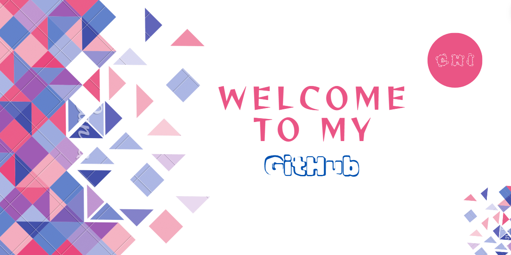

<!--Banner

-->

<!--Header Name-->
<h2 align="center">Hi, I'm Chi 🥸</h2> 

<h3 align="center" style="font-family: Arial, sans-serif; font-style: italic;">Virtual Artisan & Aspiring Employed Person</h3>
  
 

    

<!--Start Intro-->  

  
I'm a senior IT student with an avid passion for web development and mathematics.  I enjoy documentation, project management, and exploring new and random topics in my spare time.   What am I up to right now? I'm studying the bits and bobs of becoming a data analyst.   Why? To assess consumer culture on  platforms like Instagram shop or "Tiktok shop":    The topic of consumerism fascinates me.

 
<!-- Languages and Tools Section -->
<h2 align="center">🗿 Lᴀɴɢᴜᴀɢᴇs ᴀɴᴅ Tᴏᴏʟs 🗿</h2> 

  

 

<!--Trophies Section-->   
<h2 align="center">🏆 Gɪᴛʜᴜʙ Tʀᴏᴘʜɪᴇs 🏆</h2>

  

 

 

<!--Github stats Table--> 
<h2 align="center">📊 Gɪᴛʜᴜʙ Sᴛᴀᴛs 📊</h2>
<table width="100%" cellspacing="0" cellpadding="0" border="0">
  <tr>
    <td width="50%">
      <h3 align="center"><strong>Gɪᴛʜᴜʙ Sᴛᴀᴛs</strong></h3>
      

        
      

    </td>
    <td width="50%">
      <h3 align="center"><strong>Lᴀnguages</strong></h3>
      

        
      

    </td>
  </tr>
</table>

 

<!--Contribution Graph-->
<h2 align="center">📈 Cᴏɴᴛʀɪʙᴜᴛɪᴏɴ Gʀᴀᴘʜ 📈</h2>

    

---

<!--STARTS_HERE_QUOTE_CARD
<!--Dynamic Quote card updated every day at 12 PM
<h2 align="center">🌟 Tʜᴏᴜɢʜᴛ ᴏғ ᴛʜᴇ Dᴀʏ 🌟</h2>

    

-->

 
<!--ENDS_HERE_QUOTE_CARD-->

<h2 align="center">🌄 Chi's Coding Journey 🌄 </h2>

What can I say? I used to see coding/programming as some grueling time-kill that social pariahs engaged in as they sipped on their 5th energy drink in a dark corner (I kid). To my delight, coding is much more than that. Its applications are boundless in life, paving the way for expression, problem-solving, and innovation. There truly is something for everyone: beginner-friendly, sage-tier, fun-seekers, and all the in-betweens. As I recall, two events solidified my love for code: hackathons and the Odin project. The sheer knowledge and varying insights that hackathons offer far surpass any classroom. As for [the Odin project](https://github.com/TheOdinProject), it amazed me how many intricate details and tidbits Erik and his team were able to share with us *odinites*. Big ups to them.

 

<!-- Social badges section -->
<!-- Badges with custom icons - https://github.com/DenverCoder1/custom-icon-badges -->
<!-- View counter - https://github.com/DenverCoder1/Simple-View-Counter -->
<!--ChatGPT the ting-->

    
 </a>
    &nbsp;&nbsp;&nbsp;&nbsp;
    

<!--Contact Section--> 

<h2 align="center">🤝 Cᴏɴɴᴇᴄᴛ Wɪᴛʜ Mᴇ 🤝 </h2>

 
  

 

